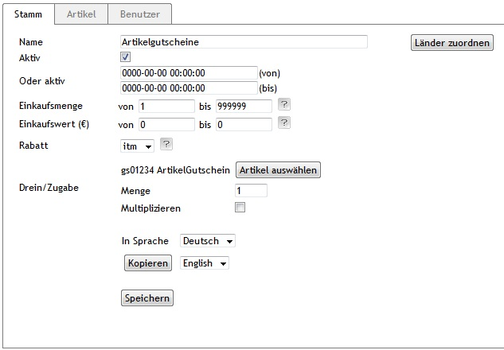

## Ablauf

* Rabatt anlegen
* Die Verkaufsmenge / Verkaufspreis min/max festlegen
* In der Auswahlliste zur Option Rabatt den Eintrag 'item' auswählen
* über den nun angezeigten Button 'Artikel auswählen' den Gutscheinartikel auswählen. Der gewählte Artikel sollte Aktiv sein und bei genutzter Lagerverwaltung entsprechenden Lagerbestand haben.

 Eventuelle Einstellungen in den anderen Feldern/Tabs sollten erst angepasst werden wenn die Funktionalität des Moduls und der Konfiguration sicher gestellt ist.

