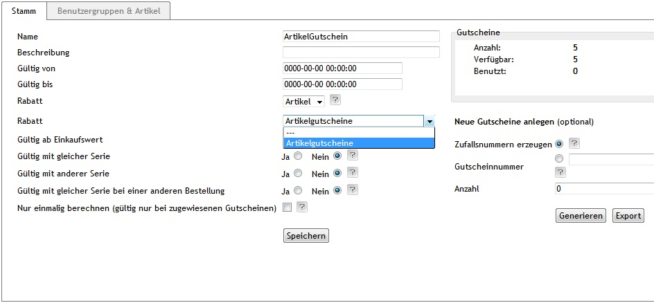

## Ablauf

* Neue Gutscheinserie anlegen 
* Anpassen der Einstellungen wie Gültigskeitszeitraum, Gültig ab Einkaufswert, Gültig mit gleicher Serie  etc setzen. Für den ersten
Test dürfen diese Einstellungen auch gern etwas weniger eingeschränkt sein. 
* In der Auswahlliste zur Option Rabatt den Eintrag 'Artikel' auswählen. Darauf hin erscheint eine weiteres Dropdownfeld/Auswahlliste.
Selektieren Sie darin den erstellten Rabatt mit dem Artikel.
* Generieren der Gutscheine.

